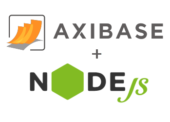

# ATSD Node.js Client



[](https://circleci.com/gh/unrealwork/atsd-api-nodejs) [](https://codeclimate.com/github/unrealwork/atsd-api-nodejs) [](https://codecov.io/gh/unrealwork/atsd-api-nodejs)

## Table of Contents

* [Overview](#overview)
* [Request Methods](#request-methods)
* [Installing Node.js Client](#installing-nodejs-client)
* [Usage](#usage)
* [Examples](#examples)

## Overview

**ATSD Node.js Client** enables developers to interact with [Axibase Time Series Database](https://axibase.com/docs/atsd/) through both [Data](https://axibase.com/docs/atsd/api/data/) and [Meta](https://axibase.com/docs/atsd/api/meta/) APIs.

---

## Implemented Methods

### ATSD Client

`ATSDClient` is the client base class. Create `ATSDClient` instance using `ATSDClient(options)` where `options` is an object:

 Key| Description| Required
 ---|---|---
 `url`       | Full ATSD URL with port.             | **Yes**
 `user`      | Username.                            | **Yes**
 `password`  | Password.                            | **Yes**
 `strictSSL` | Require SSL certificate validation. | No.<br> Default setting: `true`.

`ATSDClient` contains the asynchronous method `request`:

```javascript
ATSDClient.request(method, path, params, payload, callback)
```

Additionally, `ATSDClient` contains separate methods for each type of request:

```javascript
ATSDClient.getRequest(path, params, payload, callback)
ATSDClient.postRequest(path, params, payload, callback)
ATSDClient.putRequest(path, params, payload, callback)
ATSDClient.patchRequest(path, params, payload, callback)
ATSDClient.deleteRequest(path, params, payload, callback)
```

Arguments are enumerated below:

 Argument   | Type                            | Description
------------|---------------------------------|-----------------------------------------------------------------------------------
 `method`   | String                          | Request method: `GET`, `POST`, `PUT`, `PATCH`, or `DELETE`.
 `path`     | String                          | Path added to base ATSD API URL.<br>For example: `metrics` is appended as follows, `atsd_server/api/v1/metrics`.
 `params`   | Object                          | URL query string parameters.
 `payload`  | Object                          | JSON request payload.
 `callback` | Function(error, response, body) | Callback function.

`Entities`, `Metrics`, `Properties`, `Alerts`, and `Series` are all subclasses of `ATSDClient` and use the same constructor.

### [REST API](https://axibase.com/docs/atsd/api/data/)

The REST API allows you to insert and retrieve data from the database using HTTP requests.

#### Series

* [Series: `query`](https://axibase.com/docs/atsd/api/data/series/query.html)<br>
  Retrieves time series objects for the specified metric, entity, tags, and date range. Applies common time series transformations including aggregation, interpolation, downsampling etc.

* [Series: `insert`](https://axibase.com/docs/atsd/api/data/series/insert.html)<br>
  Inserts a timestamped array of numbers for a given series identified by metric, entity, and series tags.

#### Properties

* [Properties: `query`](https://axibase.com/docs/atsd/api/data/properties/query.html)<br>
  Retrieves property records for the specified filters including type, entity, key, and time range.

* [Properties: `get types`](https://axibase.com/docs/atsd/api/data/properties/list-types.html)<br>
  Returns an array of property types for the entity.

* [Properties: `insert`](https://axibase.com/docs/atsd/api/data/properties/insert.html)<br>
  Inserts an array of properties.

* [Properties: `delete`](https://axibase.com/docs/atsd/api/data/properties/delete.html)<br>
  Deletes property records that match specified filters.

#### Messages

* [Messages: `query`](https://axibase.com/docs/atsd/api/data/messages/query.html)<br>
  Retrieves message records for the specified filters.

* [Messages: `insert`](https://axibase.com/docs/atsd/api/data/messages/insert.html)<br>
  Inserts messages.

#### Alerts

* [Alerts: `query`](https://axibase.com/docs/atsd/api/data/alerts/query.html)<br>
  Retrieves open alerts for specified filters.

* [Alerts: `update`](https://axibase.com/docs/atsd/api/data/alerts/update.html)

* [Alerts: `history query`](https://axibase.com/docs/atsd/api/data/alerts/history-query.html)<br>
  Retrieves a list of closed alerts matching specified fields.

### [Meta API](https://axibase.com/docs/atsd/api/meta/)

The Meta API allows you to query metadata for metrics, entities, and entity groups in the database.

#### Metrics

* [Metric: `get`](https://axibase.com/docs/atsd/api/meta/metric/get.html)<br>
  Retrieves properties and tags for the specified metric.

* [Metric: `update`](https://axibase.com/docs/atsd/api/meta/metric/update.html)<br>
  Updates fields and tags of the specified metric.

* [Metric: `create or replace`](https://axibase.com/docs/atsd/api/meta/metric/create-or-replace.html)<br>
  Creates a metric with specified fields and tags or replaces the fields and tags of an existing metric.

* [Metric: `delete`](https://axibase.com/docs/atsd/api/meta/metric/delete.html)<br>
  Deletes the specified metric.

* [Metric: `series tags`](https://axibase.com/docs/atsd/api/meta/metric/series-tags.html)<br>
  Retrieves unique series tags values for the specified metric.

#### Entities

* [Entity: `get`](https://axibase.com/docs/atsd/api/meta/entity/get.html)<br>
  Retrieves fields and tags describing the specified entity.

* [Entity: `update`](https://axibase.com/docs/atsd/api/meta/entity/update.html)<br>
  Updates fields and tags of the specified entity.

* [Entity: `create or replace`](https://axibase.com/docs/atsd/api/meta/entity/create-or-replace.html)<br>
  Creates an entity with specified fields and tags or replaces the fields and tags of an existing entity.

* [Entity: `delete`](https://axibase.com/docs/atsd/api/meta/entity/delete.html)<br>
  Deletes the specified entity and removes the entity from any entity groups it belongs to.

* [Entity: `metrics`](https://axibase.com/docs/atsd/api/meta/entity/metrics.html)<br>
  Retrieves a list of metrics collected by the entity.
  
#### Entity Groups

* [Entity Group: `get`](https://axibase.com/docs/atsd/api/meta/entity-group/get.html)<br>
  Retrieves information about the specified entity group including its name and user-defined tags.

* [Entity Group: `update`](https://axibase.com/docs/atsd/api/meta/entity-group/update.html)<br>
  Updates fields and tags of the specified entity group.

* [Entity Group: `create or replace`](https://axibase.com/docs/atsd/api/meta/entity-group/create-or-replace.html)<br>
  Creates an entity group with specified fields and tags or replaces the fields and tags of an existing entity group.

* [Entity Group: `delete`](https://axibase.com/docs/atsd/api/meta/entity-group/delete.html)<br>
  Deletes the specified entity group.

* [Entity Group: `get entities`](https://axibase.com/docs/atsd/api/meta/entity-group/get-entities.html)<br>
  Retrieves a list of entities that are members of the specified entity group and are matching the specified filter conditions.

* [Entity Group: `add entities`](https://axibase.com/docs/atsd/api/meta/entity-group/get-entities.html)<br>
  Retrieves a list of entities that are members of the specified entity group and are matching the specified filter conditions.

* [Entity Group: `set entities`](https://axibase.com/docs/atsd/api/meta/entity-group/set-entities.html)<br>
  Sets members of the entity group from the specified entity list.

* [Entity Group: `delete entities`](https://axibase.com/docs/atsd/api/meta/entity-group/delete-entities.html)<br>
  Removes the specified members from the entity group.

### Additional Functions

There are a number of convenience functions dedicated to making certain requests easier to execute. Unlike the functions above, these functions do not replicate the signatures of ATSD API methods.

 Client function| Equivalent Invocation| Note
---|---|---
 `Series.query(args, callback)`                                                                 | `Series.get(payload, callback)` with `payload` being `{'queries': [args]}`                                                             | `timeFormat` for response is set to `iso`; instead of `{'series': [...]}` returns `[...]`.
 `Series.queryDetail(metric, entity, tags, startTime, endTime, callback)`                       | `Series.query(args, callback)` with `args` as an object consisting of `metric`, `entity` etc.                                       | `startTime` and `endTime` can be a timestamp in milliseconds, a string (ATSD API `startDate` and `endDate`), or a Date object.
 `Series.queryStatistic(metric, entity, tags, startTime, endTime, statistic, period, callback)` | Same as above.                                                                                                                          | Same as above.
 `Series.insertData(metric, entity, tags, data, callback)`                                      | `Series.insert(payload, callback)` with `payload` being `[inserts]` where `inserts` is an object consisting of `metric`, `entity` etc. |

For statistics and units used to aggregate the data through series queries, corresponding enumerations exist for Series class:

* `Series.statistic`
* `Series.unit`

---

## Installing Node.js Client

Install **ATSD Node.js Client** with `npm`:

```sh
npm install --save atsd-api
```

### Setup

```javascript
var atsd_api = require('atsd-api');

var options = {
  url: '...',
  user: '...',
  password: '...'
};

var entities   = new atsd_api.Entities(options);
var metrics    = new atsd_api.Metrics(options);
var series     = new atsd_api.Series(options);
var properties = new atsd_api.Properties(options);
var alerts     = new atsd_api.Alerts(options);
```

---

## Examples

**Series**:

```javascript
// inserting series data without versions
series.insertData('temperature', 'sensor001', {}, [
    {'d': '2015-11-23T08:19:00.000Z', 'v': 51},
    {'d': '2015-11-23T08:20:00.000Z', 'v': 52}
  ], function(error_insert, response, _) {
    if (!error_insert) {
      console.log('Insert: ' + response.statusCode);
    }
  }
);
```

```javascript
> Insert: 200
```

```javascript
// inserting series data with versions
series.insertData('temperature', 'sensor001', {}, [
    {'d': '2015-11-23T08:21:00.000Z', 'v': 50, 'version': {'status': 'provisional', 'source': 'gateway-1'}}
  ], function(error_insert, response, _) {
    if (!error_insert) {
      console.log('Insert with versions: ' + response.statusCode);
    }
  }
);
```

```javascript
> Insert with versions: 200
```

```javascript
// retrieving data without versions
series.queryDetail(
  'temperature', 'sensor001', {},
  'current_day', 'next_day',
  function(error_detail, _, body) {
    if (!error_detail) {
      console.log('Detail: ' + JSON.stringify(body));
    }
  }
);
```

```javascript
> Detail: [{"entity":"sensor001","metric":"temperature1","tags":{},"type":"HISTORY","aggregate":{"type":"DETAIL"},"data":[{"d":"2015-11-23T08:19:00.000Z","v":51},{"d":"2015-11-23T08:20:00.000Z","v":52},{"d":"2015-11-23T08:21:00.000Z","v":50}]}]
```

```javascript
// retrieving data with versions
series.query({
    'metric': 'temperature',
    'entity': 'sensor001',
    'startDate': 'current_day',
    'endDate': 'next_day',
    'versioned': true
  }, function(error_detail, _, body) {
    if (!error_detail) {
      console.log('Detail with versions: ' + JSON.stringify(body));
    }
  }
);
```

```javascript
> Detail with versions: [{"entity":"sensor001","metric":"temperature1","tags":{},"type":"HISTORY","aggregate":{"type":"DETAIL"},"data":[{"d":"2015-11-23T08:19:00.000Z","v":51},{"d":"2015-11-23T08:20:00.000Z","v":52},{"d":"2015-11-23T08:21:00.000Z","v":50,"version":{"source":"gateway-1","status":"provisional"}}]}]
```

```javascript
// retrieving yesterday's data averaged by 6 hours
series.queryStatistic(
  'cpu_busy', 'nurswgvml007', {},
  'previous_day', 'current_day',
  Series.statistic.AVG, {'count': 6, 'unit': Series.unit.HOUR},
  function(error, _, body) {
    if (!error) {
      console.log('Average: ' + JSON.stringify(body));
    }
  }
);
```

```javascript
> Average: [{"entity":"nurswgvml007","metric":"cpu_busy","tags":{},"type":"HISTORY","aggregate":{"type":"AVG","period":{"count":6,"unit":"HOUR"}},"data":[{"d":"2015-11-22T00:00:00.000Z","v":18.35364243323441},{"d":"2015-11-22T06:00:00.000Z","v":14.058392592592591},{"d":"2015-11-22T12:00:00.000Z","v":13.460140845070423},{"d":"2015-11-22T18:00:00.000Z","v":13.851594955489615}]}]
```

**Alerts**:

```javascript
// updating alerts 'evt-1' and 'evt-2'
alerts.update(
  [
    {
      'action': 'update',
      'fields': {
        'acknowledge': true
      },
      'alerts': [
        {'id': 'evt-1'},
        {'id': 'evt-2'}
      ]
    }
  ],
  function(error, response, _) {
    if (!error) {
      console.log('Update: ' + response.statusCode);
    }
  }
);
```

```javascript
> Update: 200
```

**Properties**:

```javascript
// getting property types of entity 'atsd'
entities.getPropertyTypes('atsd', {}, function (error, _, body) {
  if (!error) {
    console.log('Property types: ' + JSON.stringify(body));
  }
});
```

```javascript
> Property types: ["jfs","system","disk","cpu","java_method","configuration","network"]
```

```javascript
// inserting a property
properties.insert(
  [
    {
      'type':'type-1',
      'entity':'entity-1',
      'key':{'server_name':'server','user_name':'system'},
      'tags':{'name-1': 'value-1'}
    }
  ],
  function(error_insert, response, _) {
    if (!error_insert) {
      console.log('Insert: ' + response.statusCode);

      // retrieving the same property
      properties.getByEntityAndType(
        'entity-1', 'type-1', {},
        function (error_get, _, body) {
          if (!error_get) {
            console.log('Properties by entity and type: ' + JSON.stringify(body));
          }
        }
      );
    }
  }
);
```

```javascript
> Insert: 200
> Properties by entity and type: [{"type":"type-1","entity":"entity-1","key":{"server_name":"server","user_name":"system"},"tags":{"name-1":"value-1","name.1":"value-1"},"timestamp":1448122917843}]
```

**Series Dump**:

```javascript
entities.getAll({}, function (error_entities, _, body_entities) {
  if (!error_entities) {
    // choosing the first entity
    var entity = body_entities[0]['name'];

    console.log('First entity: ' + entity);

    // retrieving all metrics for that entity
    metrics.getByEntity(entity, {}, function (error_metrics, _, body_metrics) {
      if (!error_metrics) {
        // choosing the first metric
        var metric = body_metrics[0]['name'];

        console.log('First metric: ' + metric);

        // getting data for the chosen entity and metric
        series.queryDetail(
          metric, entity, {},
          'current_hour', 'current_hour + 10 * second',
          function (error_series, _, body_series) {
            if (!error_series) {
              var data = body_series[0]['data'];

              console.log('Data: ' + JSON.stringify(data));
            }
          }
        );
      }
    })
  }
});
```

```javascript
> First entity: atsd
> First metric: actions_per_minute
> Data: [{"d":"2015-11-21T14:00:02.497Z","v":0}]
```
